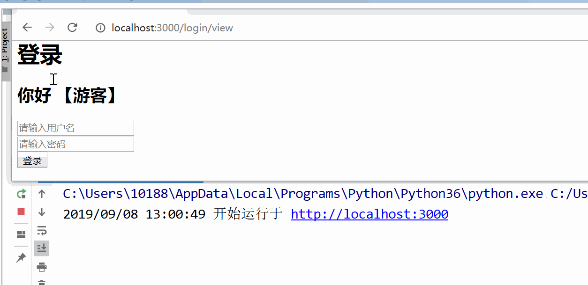
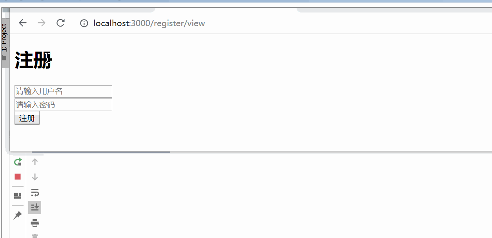
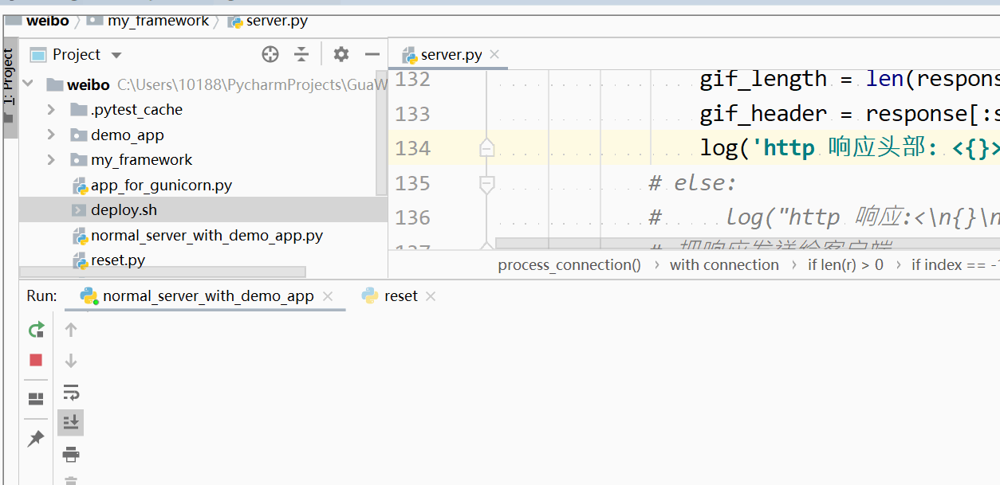
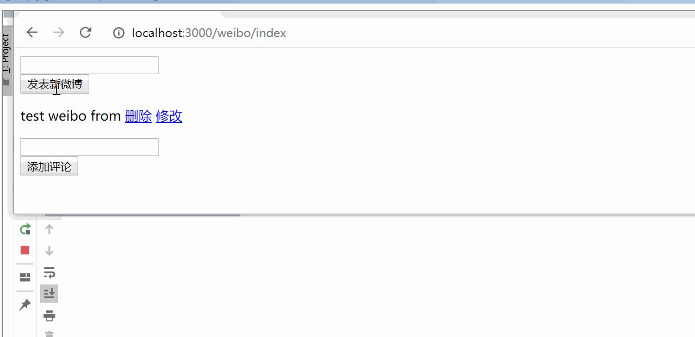

# Weibo

基于 自制 HTTP/WSGI 服务器 以及 MVC 框架搭建的 Weibo 服务

## 功能

### 1. 用户登录、注册

#### - 登录展示：

#### - 注册展示：

### 2. 微博的编辑、发布、删除

#### 微博展示：

### 3. 评论的编辑、发布、删除

#### 评论展示：

## Web 框架采用 MVC 架构来解耦和构建

- Model 模型层基于 MySQL 开发了自动生成对应 SQL 请求的自制 ORM ，实现了对增删改查接口的封装
 
- Controller 控制器层使用高阶函数利用 Python 字典实现路由分发，且封装了自定义请求和响应
 
- View 视图层基于 jinja2 封装实现了模板自动化渲染页面

## HTTP 服务器

- 实现了 HTTP 请求的 接收、解析 ，HTTP 响应的 生成、返回 并支持 WSGI 协议

- 底层通过多语言通用的 Socket 实现了 TCP/IP 通信

- 使用 多线程 实现了并发访问

## 部署

- 项目支持 Nginx 作为反向代理，过滤了静态资源请求，再用 Gunicorn 多 Worker + gevent 协程架构提高性能
 
- 使用 Shell/Bash 脚本实现了 Weibo 项目的一键部署
